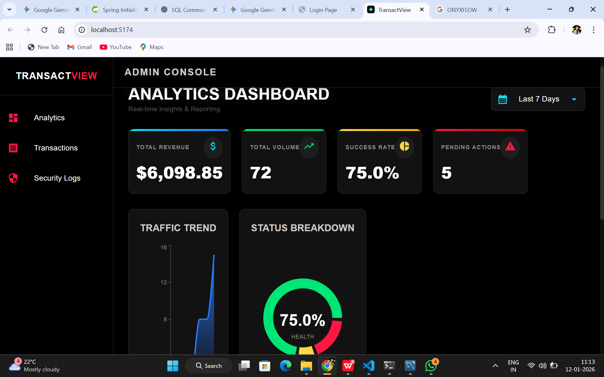
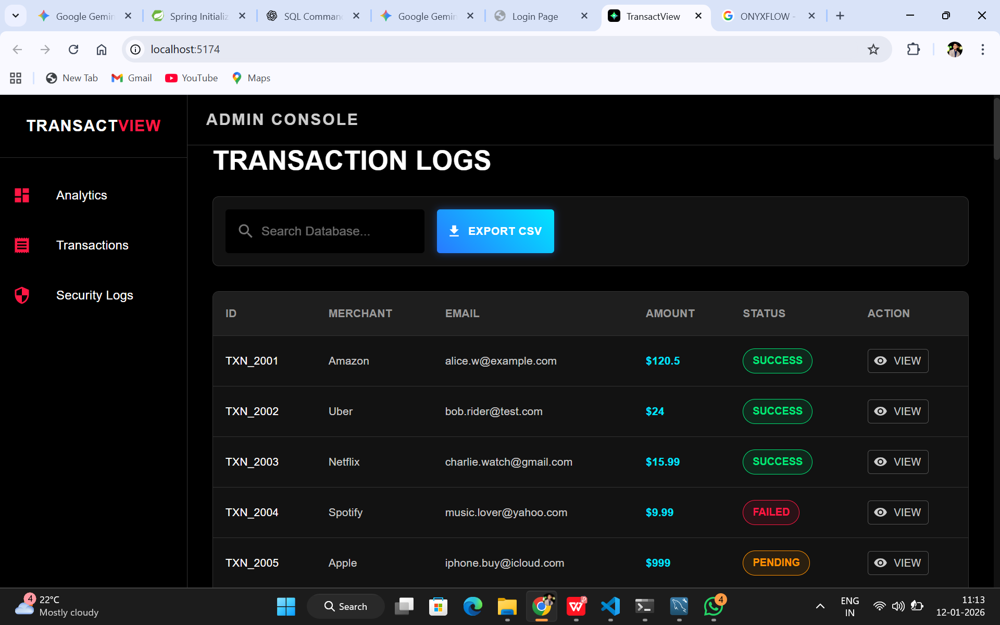
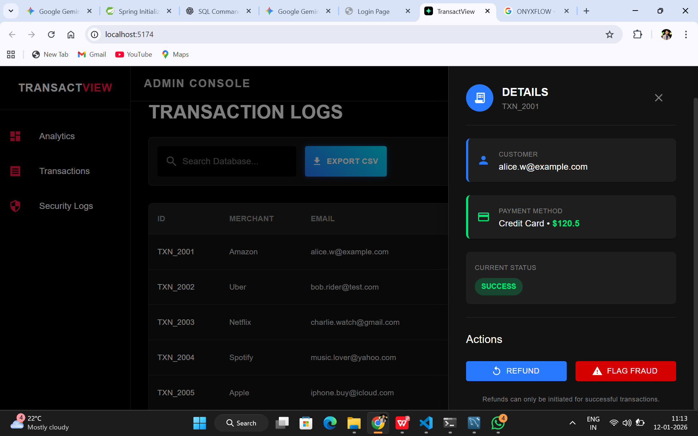
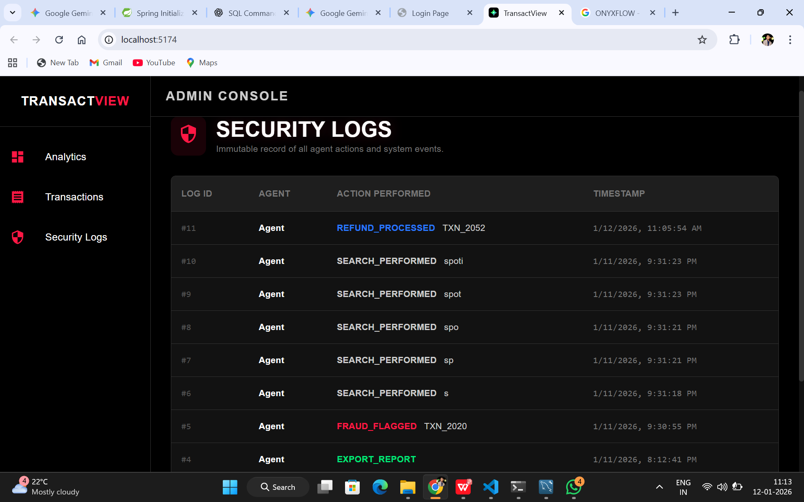

# ⚡ TransactView | Payment Admin Console

**TransactView** is a high-performance, dark-themed financial administration dashboard designed for modern payment gateways. It provides real-time analytics, transaction management, and security auditing in a sleek, high-contrast "Command Center" interface.

---

## 📸 Interface Preview

| **Analytics Dashboard** | **Transaction Management** |
|:---:|:---:|
|  |  |
| *Real-time KPIs & Traffic Trends* | *Search, Filter & CSV Export* |

| **Details Drawer** | **Security Logs** |
|:---:|:---:|
|  |  |
| *Refund & Fraud Actions* | *Immutable Action History* |

---

## 🚀 Key Features

### 📊 **Executive Analytics**
- **Dynamic Filtering:** Toggle analytics between `24 Hours`, `7 Days`, and `30 Days`.
- **Visual Intelligence:**
  - **Traffic Trend:** Area charts visualizing transaction volume over time.
  - **Health Ratio:** Neon donut charts monitoring Success vs. Failure rates.
  - **Failure Analysis:** Bar charts identifying top error codes (e.g., Insufficient Funds, Gateway Timeout).

### 💳 **Transaction Operations**
- **Global Search:** Instant filtering by Transaction ID, Merchant, or Customer Email.
- **Action Drawer:** Slide-out panel for deep-diving into transaction metadata.
- **Risk Management:** One-click controls to **Initiate Refund** or **Flag as Fraud**.
- **Data Extraction:** One-click CSV export for external reporting.

### 🛡️ **Security & Compliance**
- **Audit Trails:** Every agent action (View, Search, Refund, Export) is cryptographically logged.
- **Read-Only Audit View:** A dedicated interface for compliance officers to review system activity.

---

## 🛠️ Tech Stack

### **Frontend**
- **Framework:** React.js (Vite)
- **UI Library:** Material UI (MUI v5)
- **Charting:** Recharts
- **Styling:** Custom Cyberpunk Theme (Dark Mode)
- **HTTP Client:** Axios

### **Backend**
- **Framework:** Java Spring Boot 3+
- **Database:** MySQL 8.0
- **ORM:** Spring Data JPA (Hibernate)
- **Architecture:** REST API Layered Architecture

---

## ⚙️ Installation & Setup

Follow these steps to run the project locally.

### **1. Database Setup**
1. Open MySQL Workbench.
2. Open the file `database_setup.sql` (located in the root folder).
3. Run the script to create the database and populate it with test data.